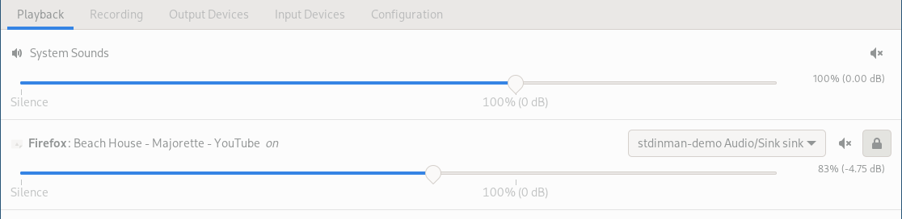

# stdinman

Tool to pipe raw audio to Discord via a bot. Input data must be PCM 32-bit floating-point little-endian (aka `f32le`).

If your audio is in any other format, it is possible to use tools like ffmpeg to convert it to the required format.

```
ffmpeg -re -i sample.mp3 -map 0:a:0 -c:a:0 pcm_f32le -ar 48000 -ac 2 -f f32le - | stdinman
```

## Motivation

There are several interesting discord bots and such floating around, such as for playing Youtube links, soundcloud etc. However, as an **Arch Linux** user, I wanted something super composable - the ability to play _any raw audio_ into Discord, via a bot.

That's exactly what this program does. It is entirely up to the user how they wish to prepare the audio source - for instance their microphone, their speaker output (i.e. alsa monitor), an internet audio stream (or anything that can be passed into ffmpeg), or spinning vinyl*. Check out the [recipes](#recipes) section for more.

## Building

Ensure you have the rust toolchain installed, for e.g. via [rustup](https://rustup.rs/), then run:

```
cargo build --release
```

The binary would be in `./target/release/stdinman` . Copy it somewhere in your PATH or run it from here directly.

## Usage

stdinman works via a Discord Bot, connected to a Voice Channel. You must ensure this bot is:

* added to the server where you want to stream audio
* has the "Connect" & "Speak" voice permissions

You'll need to provide the bot's token, and the ID of the voice channel you want it to connect to. These can be passed via CLI args:

```
stdinman --bot-token [BOT_TOKEN] --voice-channel-id [VOICE_CHANNEL_ID]
```

Alternatively, just run `stdinman` once, and it will generate a config file in `$XDG_CONFIG_HOME/stdinman/stdinman.toml` , where you can store the bot token & voice channel id.

Now just pipe audio to stdinman! Check out the [recipes](#recipes) section for some examples.

Logging can be configured via an environment variable: `export RUST_LOG=stdinman=DEBUG`

## Recipes

The recipes involving pactl are intended for use on linux with PulseAudio (or Pipewire with the Pulseaudio shim). Examples with ffmpeg could be used on Mac as well.

<details>

<summary><h3>Stream ffmpeg output to Discord</h3></summary>

[ffmpeg]) is an amazing A/V utility, that can handle an incredible amount of input formats. If you can pass audio from a source into ffmpeg, or even a video (assuming you only want the audio), you can configure it to output the audio as 32-bit floating point PCM, which can then be piped to `stdinman` and streamed to Discord.

You should use the `-re` flag on the input, to ensure ffmpeg consumes it in real time.

```
ffmpeg -re -i sample.mp3 -map 0:a:0 -c:a:0 pcm_f32le -ar 48000 -ac 2 -f f32le - | stdinman
```

</details>

<details>

<summary><h3>Stream Spotify directly to Discord (via librespot, ffmpeg)</h3></summary>

Using the incredible work by the people over at [librespot](https://github.com/librespot-org/librespot) , it is possible to create a "Spotify Connect" device your account can play audio to, who's output can be piped to another program.

Using `ffmpeg` in the middle to ensure the format matches, we can then pipe it over to `stdinman` and stream it straight to Discord!

```
librespot -n stdinman_connect --backend pipe -b 320 | ffmpeg -f s16le -ac 2 -ar 44100 -re -i pipe:0 -map 0:a:0 -c:a:0 pcm_f32le -ar 48000 -ac 2 -f f32le - | stdinman
```

For more information on how to use librespot [check out their repo](https://github.com/librespot-org/librespot).

_Note: Using librespot is [probably forbidden by Spotify](https://github.com/librespot-org/librespot#disclaimer)._

</details>

<details>

<summary><h3>(Linux) Play your computer's speakers' output via Discord</h3></summary>

_Note: If you're in the VC on the same computer, you would hear a kind of "echo" on the audio - first your headphones / speakers, and then the audio from discord with some latency. In such situations, it is recommended to output the audio to a virtual sink, and then play that via the bot (see the next recipe). This has the additional advantage of sharing a specific application's audio instead of the whole system._

You can use `pactl` to view the monitor input corresponding to your speakers:

```
$ pactl list short sources
77	alsa_output.pci-0000_00_1f.3.3.analog-stereo.monitor	PipeWire	s32le 2ch 48000Hz	SUSPENDED
78	alsa_input.pci-0000_00_1f.3.3.analog-stereo	PipeWire	s32le 2ch 48000Hz	SUSPENDED
```

In this case, `alsa_output.pci-0000_00_1f.3.3.analog-stereo.monitor` is the speakers' monitor. To use it with stdinman:

```
parec -d alsa_output.pci-0000_00_1f.3.3.analog-stereo.monitor --format=float32le --rate=48000 | stdinman
```
</details>

<details>

<summary><h3>(Linux) Play a specific app's audio ONLY via Discord</h3></summary>

This would route all audio from the app to the virtual sink, who's monitor you can then pass to `stdinman` to stream to Discord.

To do this, we first need to create a virtual sink via `pactl`. You can replace `stdinman-demo` with whatever name you want.

```
pactl load-module module-null-sink media.class=Audio/Sink sink_name=stdinman-demo channel_map=left,right
```

Then, using some GUI like `pavucontrol` , set the output of the program to this new sink: 



_(Note: you won't be able to hear this application on your normal speakers anymore)_

Then, use this sink's monitor with `parec` and pass the output to stdinman!

```
parec -d stdinman-demo.monitor --format=float32le --rate=48000 | stdinman
```
</details>


## Thanks

Many thanks to Enitoni for [pulseshitter](https://github.com/Enitoni/pulseshitter), which was my inspiration for this project.

Also thanks to the amazing developers of [serenity](https://github.com/serenity-rs/serenity/) & [songbird](https://github.com/serenity-rs/songbird/) , for making working with Discord bots and streaming audio in Rust so easy.
